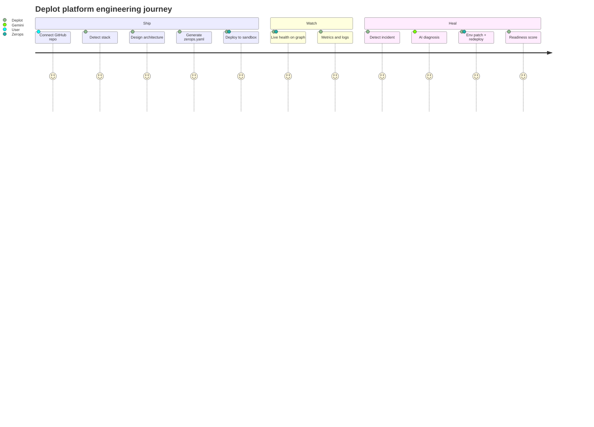
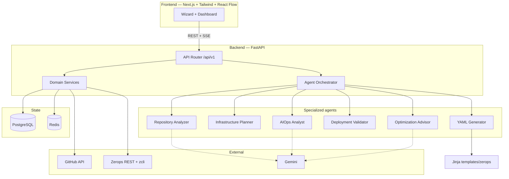
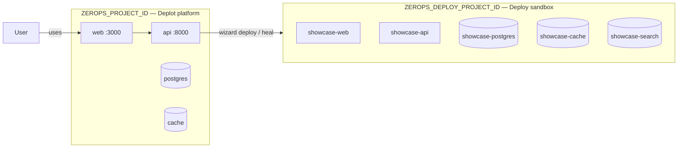
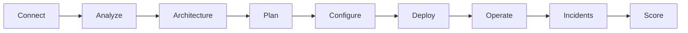
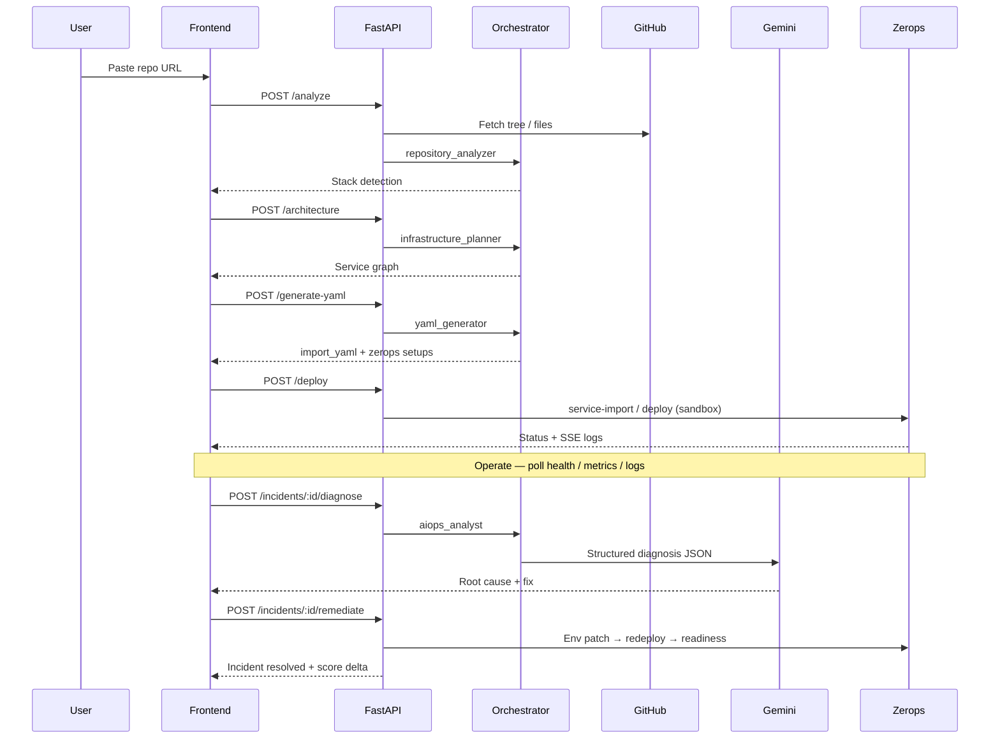
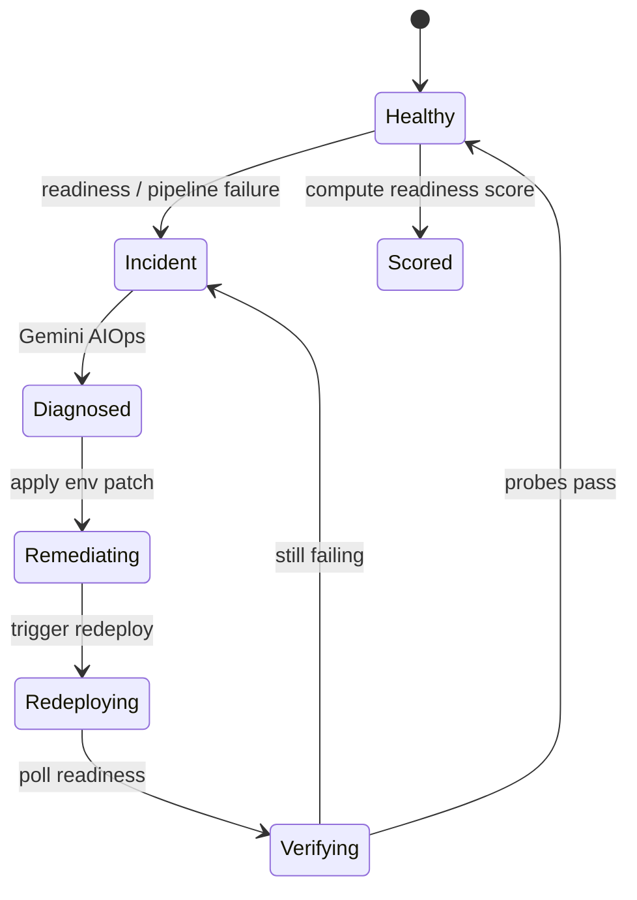

# Deplot AI

**Autonomous Platform Engineer for Zerops**

> Paste any GitHub repo → Deplot analyzes the stack, designs architecture, generates `zerops.yaml`, deploys into an isolated sandbox, watches live health, diagnoses failures in plain English, and heals production.

Built for the [**Zerops Challenge**](https://www.wemakedevs.org/hackathons/zerops) by WeMakeDevs.

[](https://web-2a39-3000.prg1.zerops.app/)
[](https://api-2a39-8000.prg1.zerops.app/api/v1/health)
[](https://github.com/maannaan/Showcase)

---

## Positioning

| | **Zeroth** | **Deplot** |
|---|---|---|
| Focus | Verify config before deploy | Architect → deploy → operate → heal |
| Output | Manifest checks / Pathfinder-style review | Running services + AIOps + readiness score |
| Differentiator | “Is this YAML safe?” | “We operate production on Zerops.” |

**One-line pitch for judges:**  
*Deplot understands any repository, generates Zerops deployment config, deploys automatically, explains failures in plain English, and helps ship production-ready apps faster.*

---

## Live demo

| Surface | URL |
|---|---|
| **Deplot UI** | https://web-2a39-3000.prg1.zerops.app/ |
| **API health** | https://api-2a39-8000.prg1.zerops.app/api/v1/health |
| **Source** | https://github.com/maannaan/Deplot |
| **Showcase target repo** | https://github.com/maannaan/Showcase |

**3-minute judge path**

1. Open the live UI → **Scripted demo OFF** (or ON for a safe walkthrough)
2. Connect `https://github.com/maannaan/Showcase`
3. Walk: **Analyze → Architecture → Plan → Configure → Deploy → Operate → Incidents → Score**
4. On Incidents: diagnose → apply fix → see score improve

---

## What Deplot does



### Features

| Layer | Capability |
|---|---|
| **Ship** | Repo intelligence, React Flow architecture, cost/time plan, `zerops.yaml` + import YAML, validation, sandbox deploy, SSE deploy logs |
| **Watch** | Living architecture graph, metrics, logs, ops timeline, routing checklist |
| **Heal** | Incident detection, Gemini AIOps diagnosis, runbook, env patch → redeploy → readiness, computed deployment score |

---

## System architecture



### Two Zerops projects (required)

Deplot **never** deploys customer/showcase stacks into its own platform project.



| Project | Env var | Purpose |
|---|---|---|
| Deplot platform | `ZEROPS_PROJECT_ID` | Hosts Deplot itself |
| Deploy sandbox | `ZEROPS_DEPLOY_PROJECT_ID` | All wizard deploys + heal tests |

---

## Wizard flow (product UX)



| Step | What judges see |
|---|---|
| **Connect** | GitHub URL or Demo Mode |
| **Analyze** | Language, framework, DB, cache, search, monorepo paths |
| **Architecture** | React Flow topology with Zerops hostnames |
| **Plan** | Estimated cost + build time |
| **Configure** | Generated import YAML + embedded `zerops.yaml` |
| **Deploy** | Live status + SSE build logs into sandbox |
| **Operate** | Health-colored graph, metrics, logs, timeline |
| **Incidents** | Root cause, impact, confidence, runbook, **Apply fix** |
| **Score** | Security / performance / scalability / reliability / observability |

---

## AI agent pipeline



| Agent | Prompt | Responsibility |
|---|---|---|
| Repository Analyzer | `prompts/repository_analyzer.md` | Stack + env signals from repo tree |
| Infrastructure Planner | `prompts/infrastructure_planner.md` | Nodes / edges / hostnames |
| YAML Generator | `prompts/yaml_generator.md` | Zerops import + per-service YAML |
| Deployment Validator | `prompts/deployment_validator.md` | Pre-deploy checks |
| AIOps Analyst | `prompts/aiops_analyst.md` | Diagnosis, runbook, env changes |
| Optimization Advisor | `prompts/optimization_advisor.md` | Score narratives / recommendations |

Agents register via `@register_agent` — no orchestrator rewrites to extend.

---

## Tech stack

| Layer | Technology |
|---|---|
| Frontend | Next.js, TypeScript, Tailwind, React Flow, SSE (`EventSource`) |
| Backend | FastAPI, Pydantic v2, registry-based services/agents |
| AI | Google Gemini (structured JSON for AIOps + optional stack enrich) |
| Data | PostgreSQL, Redis (in-memory fallback if DB unavailable) |
| Platform | Zerops (`zcli` + REST), GitHub API |
| Templates | Jinja2 (`templates/zerops/`) |

---

## Repository layout

```
Deplot/
├── backend/app/
│   ├── agents/           # BaseAgent + @register_agent implementations
│   ├── api/v1/           # analyze, deploy, aiops, observability, health
│   ├── services/         # zerops, gemini, scoring, operations, github, …
│   ├── models/           # Typed request/response schemas
│   ├── core/registry.py  # Plugin registry
│   └── bootstrap.py      # Wire services at startup
├── frontend/src/
│   ├── config/wizard-steps.ts
│   ├── components/wizard/   # architecture-graph, incident-panel, ops-timeline
│   └── app/                 # Wizard + dashboard pages
├── prompts/              # Editable agent system prompts
├── templates/zerops/     # Import YAML Jinja templates
├── zerops/               # Deplot’s own Zerops import configs
├── docs/                 # Sandbox, day-0, differentiation plan
├── scripts/              # Regression + sandbox setup
├── showcase/             # Local showcase app (also on GitHub)
└── docker/               # Local Postgres + Redis
```

---

## Quick start (local)

### Prerequisites

- Python **3.12+**, Node **22+**, Docker, [`zcli`](https://docs.zerops.io/references/zcli)
- Zerops account + API token

### 1. Environment

```bash
cp .env.example .env
```

| Variable | Purpose |
|---|---|
| `GEMINI_API_KEY` | Real AIOps diagnosis + score narrative |
| `GEMINI_MODEL` | Optional; e.g. `gemini-flash-lite-latest` if free-tier limits hit |
| `ZEROPS_API_TOKEN` | Zerops REST + zcli auth |
| `ZEROPS_PROJECT_ID` | Platform project (Deplot itself) |
| `ZEROPS_DEPLOY_PROJECT_ID` | Sandbox for wizard deploys |
| `GITHUB_TOKEN` | Optional — higher GitHub rate limits |
| `NEXT_PUBLIC_API_URL` | `http://localhost:8000/api/v1` |

> **Zerops GUI note:** custom env keys cannot start with `ZEROPS_`. For the live `api` service, use aliases such as `DEPLOT_API_TOKEN`, `PLATFORM_PROJECT_ID`, `DEPLOY_PROJECT_ID` once the app supports them — or set secrets via your deploy pipeline. Local `.env` may still use `ZEROPS_*`.

### 2. Data services

```bash
docker compose -f docker/docker-compose.yml up -d
```

### 3. Backend

```bash
cd backend
python3.12 -m venv .venv
source .venv/bin/activate   # Windows: .venv\Scripts\activate
pip install -e ".[dev]"
uvicorn app.main:app --host 127.0.0.1 --port 8000
```

> Prefer **no** `--reload` during wizard demos — reload wipes in-memory sessions.

### 4. Frontend

```bash
cd frontend
npm install
npm run dev
```

Open [http://localhost:3000](http://localhost:3000)

### 5. Health check

```bash
curl -s http://localhost:8000/api/v1/health | python3 -m json.tool
```

Expect `deploy_project_isolated: true` when both project IDs are set and different.

### 6. Deploy sandbox (once)

```bash
zcli login
zcli project project-import zerops/import-deploy-sandbox.yaml
# copy project ID → ZEROPS_DEPLOY_PROJECT_ID
```

Details: [docs/deploy-sandbox.md](docs/deploy-sandbox.md)

---

## API surface

| Method | Path | Purpose |
|---|---|---|
| `POST` | `/api/v1/analyze` | Repository intelligence |
| `POST` | `/api/v1/architecture` | Architecture graph |
| `POST` | `/api/v1/generate-yaml` | Zerops config generation |
| `POST` | `/api/v1/validate` | Pre-deploy validation |
| `GET` | `/api/v1/sessions/:id/plan` | Cost / time plan |
| `POST` | `/api/v1/deploy` | Start sandbox deploy |
| `GET` | `/api/v1/deployment/:id` | Deployment record |
| `GET` | `/api/v1/deployment/:id/status` | Live status |
| `GET` | `/api/v1/deployment/:id/observability` | Metrics, logs, health |
| `GET` | `/api/v1/deployment/:id/timeline` | Ops timeline |
| `GET` | `/api/v1/deployment/:id/incidents` | Incidents |
| `POST` | `/api/v1/incidents/:id/diagnose` | AI diagnosis |
| `POST` | `/api/v1/incidents/:id/remediate` | Apply fix + redeploy |
| `GET` | `/api/v1/deployment/:id/score` | Readiness score |
| `POST` | `/api/v1/logs/analyze` | Standalone log doctor |
| `GET` | `/api/v1/health` | Health + Zerops config flags |
| `GET` | `/api/v1/metrics` | Platform metrics |

OpenAPI docs when running locally: [http://localhost:8000/docs](http://localhost:8000/docs)

---

## Self-heal loop (differentiator)



1. Detect failure from Zerops pipeline / logs  
2. Diagnose with structured Gemini output (root cause, impact, confidence, env changes)  
3. Patch service environment  
4. Redeploy affected runtime  
5. Poll readiness until green (or timeout)  
6. Resolve incident → reliability score improves  

Demo Mode simulates heal for judges without a live sandbox failure. Real mode targets `ZEROPS_DEPLOY_PROJECT_ID`.

---

## Testing

```bash
# API regression (pytest)
./scripts/run-regression.sh --api-only

# Full: pytest + Playwright (installs deps with --install)
./scripts/run-regression.sh --install
```

Manual sandbox checklist: [docs/deploy-sandbox.md](docs/deploy-sandbox.md)

---

## Extending Deplot

**New agent**

1. Add `prompts/my_agent.md`
2. Subclass `BaseAgent` in `backend/app/agents/implementations.py`
3. Decorate with `@register_agent`
4. Call via `AgentOrchestrator.run("my_agent", context)`

**New service**

1. Subclass `BaseService` under `backend/app/services/`
2. Register in `bootstrap.py`
3. Expose via `backend/app/api/v1/`

**New wizard step**

1. Add entry in `frontend/src/config/wizard-steps.ts`
2. Render in the wizard page

---

## Documentation

| Doc | Contents |
|---|---|
| [docs/differentiation-plan.md](docs/differentiation-plan.md) | Roadmap vs Zeroth, phase checklist |
| [docs/deploy-sandbox.md](docs/deploy-sandbox.md) | Sandbox setup + real-test checklist |
| [docs/day0-zerops.md](docs/day0-zerops.md) | Account, token, first import |
| [AGENTS.md](AGENTS.md) | Contributor / agent conventions |
| [zerops/](zerops/) | Platform + sandbox import YAMLs |

---

## Hackathon submission

| Field | Value |
|---|---|
| **Title** | Deplot AI — Autonomous Platform Engineer for Zerops |
| **Repo** | https://github.com/maannaan/Deplot |
| **Live** | https://web-2a39-3000.prg1.zerops.app/ |
| **Challenge** | [Zerops Challenge — WeMakeDevs](https://www.wemakedevs.org/hackathons/zerops) |

---

## License

MIT — built for the Zerops Challenge. Use, fork, and ship.
